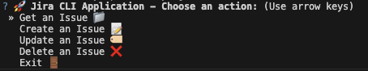

# JIRA Client CLI

A simple and interactive command-line tool to connect with JIRA and manage issues directly from your terminal. This tool lets you view, create, and update JIRA issues efficiently.

## Features
- **Get Issue Details**: Fetch detailed information about a specific JIRA issue.
- **Create Issues**: Add new issues to your JIRA projects.
- **Update Issues**: Modify the summary and description of existing issues.
- **Delete Issues**: Delete an issue.
- **User-Friendly Interface**: Interactive prompts make it easy to use.

## Prerequisites
1. **Python 3.x** must be installed on your system.
2. A **JIRA API Token** is required to authenticate. [Learn how to create a JIRA API token](https://id.atlassian.com/manage-profile/security/api-tokens).

## Installation
1. Open a terminal and navigate to the project directory:
   ```bash
   cd /path/to/project

2. Install requirements:
    pip3 install -r requirements.txt
    or 
    pip install -r requirements.txt

3. Active Python WorkSpace:
    macOS/Linux:
    source venv/bin/activate

    Windows:
    venv\Scripts\activate

4. Run main.py:
    python3 main.py
    or 
    python main.py

## User Guide:
- ### Log in to Jira user:

- ### Main Menu:

- ### Get an Issue: 
Enter issue key and see relevant information from the issue:

- ### Create an Issue:
Enter project key, summary, and description:

- ### Update an Issue:
Enter issue key summary and description

- ### Delete an Issue:
Enter issue key you want to delete:

