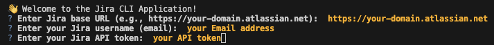
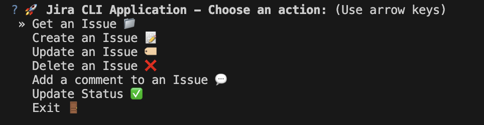
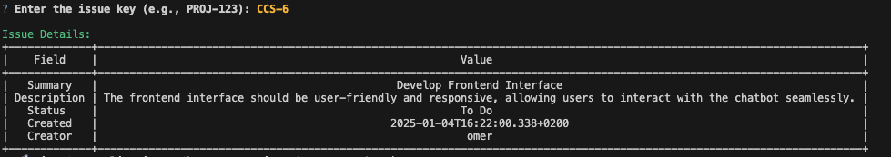
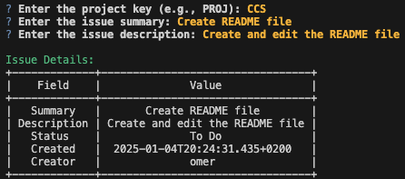
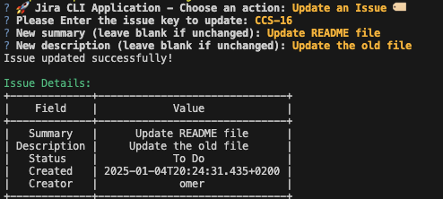
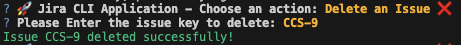

# JIRA Client CLI

A simple and interactive command-line tool to connect with JIRA and manage issues directly from your terminal. With this tool, you can view, create, update, and delete JIRA issues efficiently using an intuitive interface.

---

## Features
- **Get Issue Details**: Fetch detailed information about specific JIRA issues.
- **Create Issues**: Seamlessly add new issues to your JIRA projects.
- **Update Issues**: Modify the summary and description of existing issues directly from the CLI.
- **Delete Issues**: Remove unwanted issues quickly and easily.
- **User-Friendly Interface**: Interactive prompts make the tool easy to use, even for beginners.

---

## Prerequisites
To use this tool, ensure the following:
1. **Python 3.x** is installed on your system.
2. A **JIRA API Token** is required for authentication.  
   Learn how to create a JIRA API token [here](https://id.atlassian.com/manage-profile/security/api-tokens).

---

## Installation

1. Clone this repository: 
   ```bash
   git clone https://github.com/omer1C/JIRA-Client-CLI.git
   cd JIRA-Client-CLI
   ```

2. Install dependencies:
   ```bash
   pip install -r requirements.txt
   ```

3. Activate the Python virtual environment:
   - **macOS/Linux**:
     ```bash
     source venv/bin/activate
     ```
   - **Windows**:
     ```bash
     venv\Scripts\activate
     ```

4. Run the main script:
   ```bash
   python main.py
   ```

---

## User Guide

### Log in to JIRA:
Authenticate your JIRA account using your API token.  


---

### Main Menu:
Navigate through the main menu to access features like fetching, creating, updating, or deleting issues.  

---

### Get Issue Details:
Enter the issue key to retrieve detailed information about a specific issue.  


---

### Create an Issue:
Provide the project key, summary, and description to create a new issue.  


---

### Update an Issue:
Modify the summary and description of an existing issue by entering its issue key.  


---

### Delete an Issue:
Enter the issue key to delete an unwanted issue from your project.  


---

## Contributing
Contributions are welcome! Feel free to open an issue or submit a pull request to improve this tool.


---

## Contact
For questions or support, reach out via [GitHub Issues](https://github.com/omer1C/JIRA-Client-CLI/issues).
